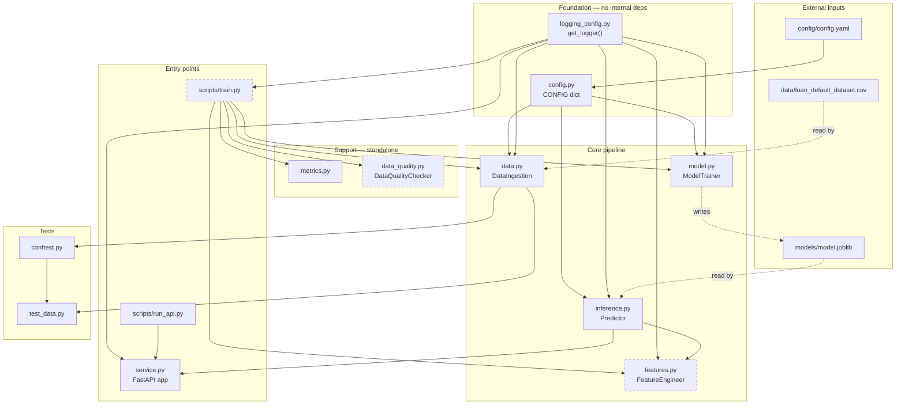

# Architecture — Loan Default Risk (Assignment II, Group 40)

Folder structure and module dependency map for the `loan_default` package.

Legend: **[DONE]** implemented and tested. Every module is now implemented;
no stubs or skipped tests remain (88 pytest tests, all passing).


> Rendered by `docs/make_architecture_diagram.py` (matplotlib) — re-run it after
> any structural change. Outputs `docs/architecture.png` (200 dpi, for the
> report) and `docs/architecture.svg` (vector).

---

## 1. Folder structure

```
Assignment_2/
│
├── config/
│   └── config.yaml                 [DONE] paths, hyperparams, drop-lists, thresholds
│
├── data/
│   └── loan_default_dataset.csv    raw Kaggle file (148,670 x 34)
│                                   NOTE: config points at data/raw/ — see §4
│
├── models/
│   └── .gitkeep                    model.joblib lands here after training (gitignored)
│
├── notebooks/
│   └── README.md                   describes the notebook + provenance
│   └── research_prototype.ipynb    [DONE] research code half of Obj 1.2 (executed)
│
├── scripts/                        ── entry points (thin; no business logic) ──
│   ├── train.py                    [DONE] step 4: wire data -> features -> model -> save
│   └── run_api.py                  [DONE] uvicorn loan_default.service:app :8000
│
├── src/
│   └── loan_default/               ── the package (all business logic) ──
│       ├── __init__.py             [DONE] __version__ = "0.1.0"
│       ├── config.py               [DONE] loads config.yaml -> CONFIG dict at import
│       ├── logging_config.py       [DONE] get_logger(); one format for every module
│       ├── data.py                 [DONE] KNOWN_COLUMNS, SERVING_FEATURES,
│       │                                  DataIngestion, SchemaValidationError
│       ├── features.py             [DONE] FeatureEngineer (sklearn transformer)
│       ├── features.py             [DONE] step 3: FeatureEngineer (sklearn transformer)
│       ├── model.py                [DONE] ModelTrainer.train / .save  (RandomForest)
│       ├── inference.py            [DONE] Predictor: load, predict_proba, decide, score
│       ├── data_quality.py         [DONE] DataQualityChecker, 8 checks, PASS/WARN/FAIL
│       ├── metrics.py              [DONE] model_quality() + data_quality()
│       └── service.py              [DONE] FastAPI: /health, /predict, /docs, / (UI)
│
├── tests/                          ── pytest suite ──
│   ├── __init__.py
│   ├── conftest.py                 [DONE] raw_df fixture: synthetic 50 x 34 frame
│   ├── test_data.py                [DONE] 5 data-validation tests — the only live ones
│   ├── test_features.py            [DONE] 11 unit tests
│   ├── test_model.py               [DONE] 2 training tests (overfit small batch)
│   ├── test_inference.py           [DONE] 20 shape/range/invariance/directional tests
│   ├── test_api.py                 [DONE] 16 integration tests
│   └── test_data_quality.py        [DONE] 36 checker + PSI drift tests
│
├── docs/
│   ├── architecture.png            rendered diagram (200 dpi)
│   ├── architecture.svg            rendered diagram (vector)
│   └── make_architecture_diagram.py  matplotlib source for both
│
├── pyproject.toml                  black 88 / isort / pytest (pythonpath = ["src"])
├── .flake8                         max-line-length 88; excludes notebooks, data, models
├── .gitignore                      ignores data/raw/*, data/processed/*, *.joblib
├── requirements.txt                pandas, sklearn, fastapi, uvicorn, pytest, linters
└── README.md                       objective -> file map, setup, run commands
```

---

## 2. Module dependency graph

Arrows point **from** the importer **to** what it imports.



Solid arrows are imports that exist in the code today. Dotted arrows are file I/O or
edges the TODO steps will add.

### Same graph as ASCII (for the report / terminal)

```
                       config/config.yaml
                               |
                               v
     logging_config.py     config.py                  <-- foundation layer
        (get_logger)        (CONFIG)                      (zero internal imports)
          |  |  |  |          |  |  |
   .------'  |  |  '----.     |  |  '------------.
   |         |  |       |     |  '-----.         |
   v         v  v       v     v        v         v
 data.py  features.py  model.py    inference.py  service.py
   |          |          |             ^            |
   |          |          |             |            v
   |          |          '--- model.joblib ---'   /health   
   |          |            (save)      (load)     /predict 
   |          |                                      ^
   |          '---- (step 5: transform) ----.        |
   |                                        |   run_api.py (uvicorn)
   v                                        |
 loan_default_dataset.csv              metrics.py   data_quality.py
                                       (standalone) (standalone)

            scripts/train.py  ==== orchestrates ===>  data -> features -> model
                                                      + metrics + data_quality
```

---

## 3. Runtime flows

### Training flow

```
python scripts/train.py
  │
  ├─ DataIngestion().load_and_validate(CONFIG.data.raw_path)
  │     ├─ load()            -> pd.read_csv, log shape + class balance
  │     └─ validate_schema() -> FAIL (raises) on a missing required column
  │                             WARN on unknown col / non-binary target
  │
  ├─ metrics.data_quality(df)              -> missingness / shape / duplicates (log only)
  │
  ├─ DataQualityChecker().run_all(df)      -> 8 x CheckResult(PASS|WARN|FAIL)
  │     └─ raise_on_fail()                 -> FAIL stops the run; WARN logs and continues
  │
  ├─ y = df[TARGET].astype(int); X = df.drop(columns=[TARGET])
  │     (ID / Gender / leakage columns are dropped INSIDE FeatureEngineer,
  │      not here — one place decides what the model consumes)
  │
  ├─ ModelTrainer().train_and_select(X, y)
  │     ├─ train_test_split(test_size=0.25, stratify=y, random_state=42)
  │     ├─ for each of 3 candidates (LogReg / RandomForest / HistGradientBoosting):
  │     │     Pipeline([FeatureEngineer(), clf]).fit(X_train, y_train)
  │     │     metrics.model_quality(...)  -> accuracy / precision / recall / f1
  │     │                                    / roc_auc / pr_auc
  │     └─ select the best by CONFIG.model.selection_metric (pr_auc)
  │
  ├─ metrics.drift_report(X first half, X second half, columns=SERVING_FEATURES)
  │     -> PSI self-check that the file is internally homogeneous
  │
  └─ ModelTrainer().save()                 -> models/model.joblib
                                              (the whole fitted Pipeline, not just the
                                               classifier — preprocessing travels with it)
```

### Serving flow

```
POST /predict  {LoanApplication}
  │
  ├─ Pydantic validates the payload      -> 422 before anything reaches sklearn
  │
  ├─ Depends(get_predictor)              -> lazy, cached Predictor()
  │     (missing artifact -> HTTPException 503 "Model not trained yet";
  │      /health reports model_artifact_present: false)
  │
  ├─ Predictor.score(record)
  │     ├─ Pipeline.predict_proba(df)[:, 1]
  │     │     └─ FeatureEngineer.transform runs INSIDE the pipeline, so serving
  │     │        applies exactly the transforms fitted at training time
  │     └─ decide(p) -> approve / refer / decline, banded by CONFIG.decision
  │
  └─ PredictionResponse{default_probability, prediction, decision}
```

### Column-derivation flow (why the counts are what they are)

```
KNOWN_COLUMNS (34, pinned in data.py)
      minus  id_sensitive_columns  = ID, Gender                       (2)
      minus  leakage_columns       = Interest_rate_spread,
                                     rate_of_interest,
                                     Upfront_charges, credit_type     (4)
      minus  target_column         = Status                           (1)
      ============================================================
      SERVING_FEATURES = 27        REQUIRED_COLUMNS = 27 + 1 = 28
                                   (pinned by test_data.py)
```

`SERVING_FEATURES` is **derived**, never hand-written — editing `config.yaml` is the
only place a column list changes.

---